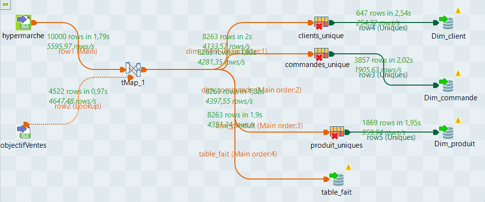

# 📊 Talend ETL Project - Hypermarket Pipeline

This repository contains a complete ETL pipeline project built with **Talend Open Studio**.

## 🧩 Overview



- Extracts data from Excel files (`Hypermarché.xlsx` and `Objectifs_ventes.xlsx`)
- Transforms and maps data to dimension and fact tables using `tMap`
- Deduplicates dimension tables
- Loads the result into a MySQL database

---

## 📁 Project Structure

```
PIPELINE_TALEND/
├── code/
├── context/
├── metadata/
├── poms/
├── process/
├── routes/
├── data/
│   ├── Hypermarché.xlsx
│   └── Objectifs_ventes.xlsx
├── talend.project
├── .project
├── README.md
└── .gitignore
```

---

## 📥 Prerequisites

- [Talend Open Studio](https://www.talend.com/products/talend-open-studio/)
- Java 11+
- MySQL (or Docker)

---

## 🐳 Quick MySQL Setup (Docker)

```bash
docker run --name talend-mysql -e MYSQL_ROOT_PASSWORD=root -e MYSQL_DATABASE=talend_db -p 3306:3306 -d mysql:latest
```

Then connect and create the user:

```sql
CREATE USER 'berto'@'%' IDENTIFIED BY 'bertomdp';
GRANT ALL PRIVILEGES ON talend_db.* TO 'berto'@'%';
FLUSH PRIVILEGES;
```

---

## 🔌 Talend MySQL Connection Parameters

| Field       | Value       |
|-------------|-------------|
| Host        | localhost   |
| Port        | 3306        |
| Database    | talend_db   |
| Username    | berto       |
| Password    | bertomdp    |

---

## 📂 Required Files

You must place the Excel files in the exact following path **on your computer** so Talend can find them:

```
C:/Data/Hypermarché.xlsx
C:/Data/Objectifs_ventes.xlsx
```

If not, update the paths in the Talend components `tFileInputExcel_1` and `tFileInputExcel_2`.

✅ The files are provided in the `data/` folder of this repo.

---

## 🚀 How to Run the Project in Talend

1. Open Talend Open Studio
2. Choose "Import Project" → select the `PIPELINE_TALEND` folder or zip
3. Open the job `j_dwh`
4. Make sure the Excel files are in `C:/Data/` or update their paths
5. Click **Run** to execute the job

---

## 📌 Notes

- Job uses `tMap`, `tUniqRow`, `tDBOutput`, `tFileInputExcel`
- Data is loaded into: `Dim_client`, `Dim_commande`, `Dim_produit`, `table_fait`
- Lookup join is made on Category, Date, and Segment

---

## 🧠 Tip for Linux/macOS

If you're not on Windows and `C:/Data/` doesn’t exist, place the Excel files anywhere and change the path in `tFileInputExcel` components.

